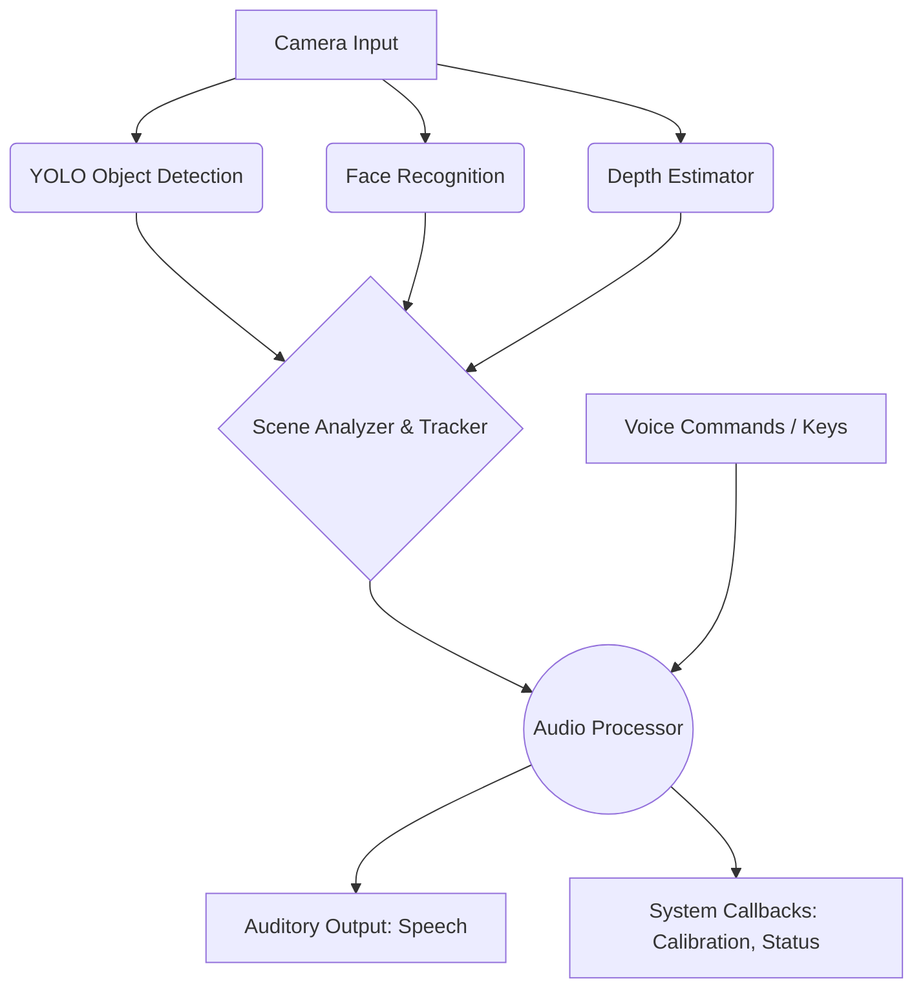

<div align="center">
  <h1>🌟 VISION GUIDE AI / NAVIS AI 🌟</h1>
  <p><em>An advanced auditory and navigation interface system for the visually impaired.</em></p>

  [](https://www.python.org/)
  [](https://pytorch.org/)
  [](https://opencv.org/)
  [](https://opensource.org/licenses/MIT)
</div>

<p align="center">
  <b>NAVIS AI</b> acts as a reliable smart co-pilot for visually impaired individuals, turning real-world scenes into rich auditory descriptions and intelligent voice interactions in real-time.
</p>

---

## 📑 Table of Contents
1. [Key Features](#-key-features)
2. [Architecture Overview](#-architecture-overview)
3. [Prerequisites](#-prerequisites)
4. [Installation](#-installation)
5. [Usage & Commands](#-usage--commands)
6. [Project Structure](#-project-structure)

---

## 🚀 Key Features

* **Real-time Object Detection:** Identifies obstacles and objects utilizing `YOLOv8`.
* **Depth & Distance Estimation:** Accurately calculates the exact distance (in steps or meters) to potential obstacles.
* **Smart Scene Analyzer:** Periodically summarizes your surroundings, tracking new or missing objects while limiting noise.
* **Personalized Face Recognition:** Recognizes friends and family dynamically so you always know who is around you.
* **Intelligent Voice Assistant:** Interact seamlessly via voice commands. Ask for scene descriptions or trigger calibrations purely by talking!
* **Emergency & GPS:** Provides built-in capability for location tracking and emergency contacts.
* **Graphical Control Interface:** Contains a local GUI (using `PyQt5`) for easy troubleshooting and status monitoring.

---

## 🧭 Architecture Overview



---

## 💻 Prerequisites

- **Python:** `3.13` or newer
- **OS:** Windows / Linux / macOS
- **Hardware:** Webcam/Camera required.

---

## 🛠 Installation

**1. Clone the Repository:**
```bash
git clone https://github.com/Amaan3073/VisionGuide.git
cd VisionGuide
```

**2. Create a Virtual Environment (Recommended):**
```bash
python -m venv venv
# Windows
venv\Scripts\activate
# Unix/MacOS
source venv/bin/activate
```

**3. Install Dependencies:**
```bash
pip install -r requirements.txt
```

---

## 🕹 Usage & Commands

Run the main application interface by executing:
```bash
python src/main.py
```
> **Note:** On your first run, YOLO models (`.pt`) and Transformer models might automatically download weights.

### 🎮 Keyboard Controls
If you have the GUI window active, you can use these shortcuts:
- <kbd>S</kbd> : Trigger an immediate descriptive summary of the scene.
- <kbd>V</kbd> : Start voice command mode (Say things like "Describe scene", or "Status").
- <kbd>C</kbd> : Initiate manual depth calibration mode.
- <kbd>M</kbd> : Request current calibration metrics & status.
- <kbd>Q</kbd> : Quit/Interrupt active process or calibration.

### 🎤 Sample Voice Commands
1. *"Describe the scene."* (The system will analyze and read aloud all active surroundings)
2. *"Status."* (Get system health and calibration data)
3. *"Calibrate."* (Allows adding custom scaling factors based on known distances)

---

## 📁 Project Structure

```text
VisionGuide-AI/
├── src/
│   ├── main.py              # Application Entry Point & NAVIS AI Class
│   ├── core/                # Core AI Engine (Detector, Depth, Audio, Trackers)
│   ├── ui/                  # PyQt5 Frontend
│   └── utils/               # Configurations and helper scripts
├── tests/                   # Base unit tests
├── test_basic.py            # Quick hardware validation script
├── requirements.txt         # Package dependencies
└── .gitignore               # Ignored environments and AI models
```

---

<div align="center">
  <i>"Empowering visually impaired individuals to navigate the world independently."</i>
</div>
